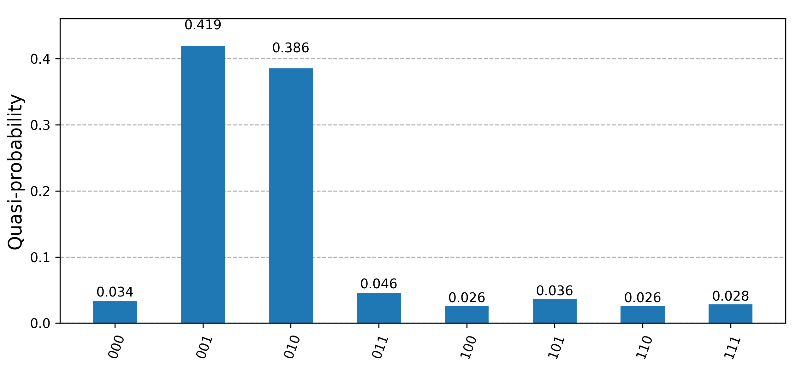
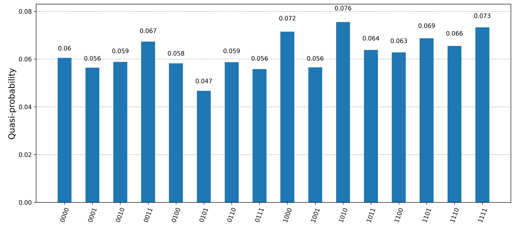

# Quantum String Matching Demo

## Introduction

This demo showcases a **quantum string matching algorithm**, designed to identify whether a given substring exists within a larger string using principles from quantum computing. It serves as a basic illustration of how quantum parallelism and interference can be leveraged to accelerate string search problems compared to classical approaches.

The algorithm is implemented using **Qiskit**, a Python-based framework for quantum computing. While this version is simulated on a classical backend, it lays the groundwork for future deployment on real quantum hardware.

## Qiskit 

Qiskit is an open source software development kit for quantum computing. It allows users to create and run quantum programs on simulators or quantum hardware. Qiskit has been undergoing rapid developmental changes due to developments in teh field of quantum computing.

Qiskit underwent breaking changes as it switched from its older Qiskit 0.46 version to Qiskit 1.0 in 2024. Most of the commands and packages used look different and the older codes are not at all compatible with the new version. For Demo 1, we will be using Qiskit 1.0 and the Qiskit Runtime service, which allows us to execute quantum computations on IBM quantum hardware. For Demo 2, we will be using the older Qiskit 0.45.0, along with the corresponding older packages.

## Demo 1
This ia a demo of the Grover's algorithm, taken from 'https://learning.quantum.ibm.com/tutorial/grovers-algorithm'. To run this on a quantum hardware, requires the creation of a personal account on IBM Qiskit. This gives you free 10 minutes of runtime on quantum hardware per month. 

 First, we install the required packages in our virtual environment:
```
python -m venv qiskit_env1
qiskit_env1\Scripts\activate
pip install qiskit
pip install qiskit-ibm-runtime
```
We also require the following to visualise our results:

```
pip install matplotlib
pip install 'qiskit[visualization]'
```
To set up the IBM quantum platform, follow the instructions here: https://docs.quantum.ibm.com/guides/setup-channel.
Essentially, you need to create an account on the IBM Quantum login page. The retrieve the API key from there, ans use it as ```<your_token>```, to run the following:

```
from qiskit_ibm_runtime import QiskitRuntimeService
 
QiskitRuntimeService.save_account(
  token=<your_token>,
  channel="ibm_quantum" # `channel` distinguishes between different account types
)
# Load saved credentials
service = QiskitRuntimeService()
```

Once we have all the dependencies in place, we can run the groverdemo.py in the cirtual environment.

```
> & <path to virtual env>/Scripts/python.exe <path to groverdemo.py>/groverdemo.py
```

### Results
We are searching for 2 target states among all possible quantum states in the demo. The ```marked_states``` array stores these states. The code searches for an IBM system which is least in use and uses that to execute the backend operations.

If we have 2 marked states of length 3 (010 and 001), we get a reliable outcome:



But if we increase the number of qubits by one, and have staes of length 4 (0110, 1001), we do not get reliable results:



This indicates that quantum hardware being used is not yet efficient enough to work with larger data.


## Demo 2

To run the string matching demo, ensure you have the python installed. Create a virtual environment, activate it and install required Qiskit dependencies. The string matching demo requires the older version of qiskit.

```
python -m venv qiskit_env2
qiskit_env2\Scripts\activate
pip install qiskit==0.45.0
pip install qiskit-aer==0.13.2
pip install ibm-cloud-sdk-core==3.18.2
```
To ensure the correct versions have been installed, run

```
python -c "import qiskit; print(qiskit.__qiskit_version__)"
```
We also require the following to visualise our results:

```
pip install matplotlib
pip install 'qiskit[visualization]'
```
Once we have all the dependencies in place, we can run the script _stringmatchingdemo.py_ in the virtual environment.

```
> & <path to virtual env>/Scripts/python.exe <path to stringmatchingdemo.py>/stringmatchingdemo.py
```

### Results

The code accepts strings x (the binary pattern) and string y (the binary text), such that length of y > length of x. It returns the position of occurrence of x in y. It also plots corresponding histograms, which indicate the number of times each output is obtained in 100 runs of the curcuit.

Refer slides for relevant histogram plots.


